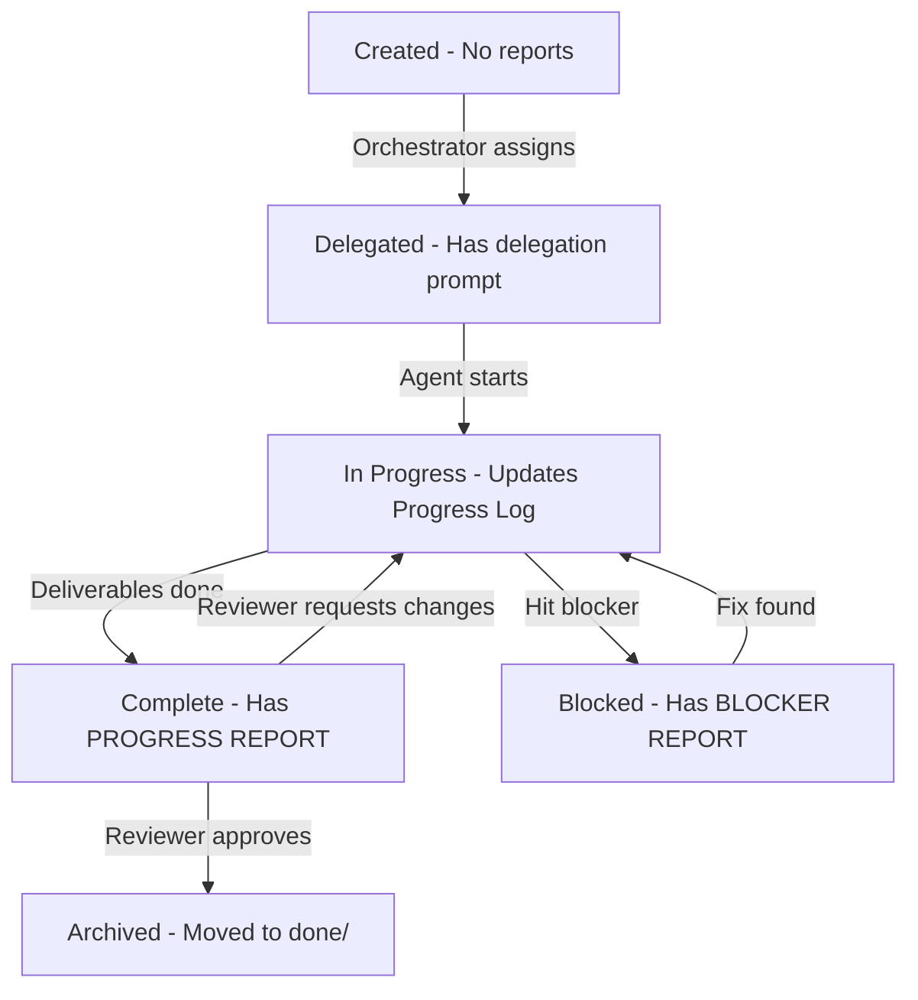

# Deep Analysis: Legacy Task File Architecture

**Date**: 2024-12-24  
**Purpose**: Understand how legacy task files served as living documents with embedded delegation, reports, and workflow state

---

## Critical Discovery: Task File as Living Workflow Document

### The Pattern

Legacy task files are **NOT static templates** - they are **living workflow documents** that evolve through the task lifecycle. Each file contains:

1. **Delegation Prompt** (top section) - Agent instructions
2. **Progress Reports** (added dynamically) - Status updates from agents
3. **Blocker Reports** (added when blocked) - Detailed blocker analysis
4. **Task Details** (bottom section) - Static metadata and requirements
5. **Progress Log** (living history) - Chronological narrative

### Key Insight: Reports Live IN the Task File

**Current .xeyth approach**: Reports in separate `.report` files  
**Legacy approach**: Reports as **sections within the `.task` file itself**

This is why it worked so well - **single file contains entire workflow history**.

---

## Anatomy of Legacy Task Files

### Example 1: NukeDynamicLoggingResearch.task (Active with Reports)

**Structure**:
````markdown
---
## Role: Implementer
{Delegation instructions}
---

# BLOCKER REPORT
{Added by Reviewer when build failed}

# PROGRESS REPORT
{Added by Implementation Agent when complete}

---
# TASK DETAILS
---
{Static task metadata}
````

**Workflow Timeline**:
1. **Creation**: Only delegation + task details exist
2. **Implementation**: Agent works, updates Progress Log
3. **Completion**: Agent adds PROGRESS REPORT section
4. **Review**: Reviewer encounters blocker, adds BLOCKER REPORT section
5. **Archive**: Entire history moves to done/ directory

### Example 2: AndroidBuildFailureFix.task (Planner-assigned)

**Structure**:
````markdown
---
# DELEGATION PROMPT
---
## Role: Planner
{Instructions for Planner}

---
# TASK DETAILS
---
{Static metadata}

## Progress Log
- 2025-12-24: Task created
- 2025-12-24: Strategic Agent (Planner) researched, selected Option A
````

**Key Difference**: No reports yet because still in planning phase

### Example 3: SignalRClientIntegration.task (Proposed)

**Structure**:
````markdown
# SignalR Client Integration

Task: ...
Status: Proposed
{Entire task specification}
````

**Key Difference**: No delegation prompt section yet - waiting for Orchestrator to assign

---

## Report Sections: Deep Analysis

### PROGRESS REPORT Section

**When Added**: Agent completes deliverables and delegates to next role

**Format**:
````markdown
---
# PROGRESS REPORT
---

**Date**: {YYYY-MM-DD}
**Agent**: {AgentID}
**Status**: {Completed|In-Progress|Paused-For-Input}

## Summary
{What was accomplished}

## Deliverables
- [x] Completed items
- [ ] Pending items

## Verification
{Build output, test results, commit hash}

## Challenges/Decisions
{Issues encountered, how resolved}

## Next Steps
{What should happen next}
````

**Purpose**: Provides context for next agent without reading entire file

### BLOCKER REPORT Section

**When Added**: Agent encounters showstopper

**Format**:
````markdown
---
# BLOCKER REPORT
---

**Date**: {YYYY-MM-DD}
**Agent**: {AgentID}
**Severity**: {Critical|High|Medium}

## Blocker Description
{Clear problem statement}

## Impact
- Blocked Deliverables
- Partial Progress
- Affected Systems

## Attempted Solutions
1. What was tried
2. Outcome

## Root Cause Analysis
{Why blocker exists}

## Recommendation
{Path forward with options}

## Options Considered
- Option A: {Pros/Cons}
- Option B: {Pros/Cons}

## Context/Logs
```text
{Error output}
```
````

**Purpose**: Escalate to Orchestrator with full context for decision-making

### Planning Sign-off Section

**When Added**: During iterative planning (Planner ↔ Implementation Agent)

**Format**:
````markdown
## Planning Sign-off

**Strategic Agent (Planner)**: {⏳ Pending|✅ APPROVED - YYYY-MM-DD - CommitSHA}
- Rationale: {Why}

**Implementation Agent**: {⏳ Pending|✅ APPROVED - YYYY-MM-DD - CommitSHA}
- Rationale: {Why}

**Iteration Summary**:
- Iteration 1: {Proposal} → {Feedback}
- Iteration N: {Final} → {Approved}
````

**Purpose**: Track collaborative planning convergence

---

## Workflow State Machine

### Task Lifecycle States



### Section Addition Timeline

| Stage | Sections Present |
|-------|-----------------|
| **Creation** | Delegation Prompt (if assigned), Task Details |
| **Planning Iteration** | + Planning Sign-off section |
| **Implementation** | + Progress Log updates |
| **Completion** | + PROGRESS REPORT section |
| **Blocked** | + BLOCKER REPORT section |
| **Review** | All sections present |
| **Archive** | Entire history preserved in done/ |

---

## Why This Architecture Works

### 1. Single Source of Truth

**Problem Solved**: No hunting for related files  
**Benefit**: Open one `.task` file, see entire workflow history

**Current .xeyth issue**: Reports in separate files → need to track multiple files

### 2. Contextual Continuity

**Problem Solved**: Next agent has full context  
**Benefit**: PROGRESS REPORT tells story; next agent knows exactly where things are

**Example** (NukeDynamicLoggingResearch.task):
- Implementation Agent adds PROGRESS REPORT: "PoC complete, ready for review"
- Reviewer reads report, sees verification was done
- Reviewer tries dual build, hits blocker
- Reviewer adds BLOCKER REPORT in same file
- Orchestrator reads both reports in one file, understands full situation

### 3. Living History

**Problem Solved**: Task evolution visible  
**Benefit**: Progress Log + Report sections = complete narrative

**Example** (AndroidBuildFailureFix.task):
```markdown
## Progress Log
- 2025-12-24: Created (blocker discovered)
- 2025-12-24: Planner researched, selected Option A

{No PROGRESS REPORT yet - still in planning}
```

### 4. Delegation Self-Contained

**Problem Solved**: Agent knows what to do immediately  
**Benefit**: Delegation prompt at top = instant context

**Example** (NukeDynamicLoggingResearch.task):
````markdown
---
## Role: Implementer

**Your Responsibilities**:
1. Research dynamic logging
2. Create PoC
3. Write implementation task

{Agent reads this, knows exactly what to do}
````

---

## Current .xeyth Gaps

### Gap 1: Reports in Separate Files

**Current**: `ContractValidation.task.Progress.report` as separate file  
**Legacy**: PROGRESS REPORT section inside `ContractValidation.task`

**Impact**:
- Must track multiple files
- Lose single-file narrative
- Harder to archive (must move all related reports)

### Gap 2: No Report Templates in Task Files

**Current**: Generic templates in Planning/  
**Legacy**: Report sections added directly to task file

**Impact**:
- Agents don't know where to put reports
- Report format varies
- No clear "add report here" guidance

### Gap 3: Delegation Prompt Not Always Present

**Current**: Some tasks have delegation info, some don't  
**Legacy**: EVERY task has delegation prompt section at top (even if "Proposed" status)

**Impact**:
- Unclear who should work on task
- No clear instructions for assigned agent

---

## Recommendations for .xeyth Adoption

### Recommendation 1: Reports Inside Task Files ✅ CRITICAL

**Change**: Move from external `.report` files to sections inside `.task` files

**Implementation**:
1. Update Task.task.template to include report section placeholders:
   ````markdown
   ---
   # PROGRESS REPORT (Added by agent when reporting status)
   # Remove this comment when creating tasks; agents add content here
   ---
   
   {Empty until agent adds report}
   
   ---
   # BLOCKER REPORT (Added by agent when blocked)
   # Remove this comment when creating tasks; agents add content here
   ---
   
   {Empty until agent adds blocker}
   
   ---
   # TASK DETAILS
   ---
   ````

2. Update Flow.prompt.md and Implementation.prompt.md:
   - "When complete, add PROGRESS REPORT section to task file"
   - "When blocked, add BLOCKER REPORT section to task file"

**Benefits**:
- Single file = complete history
- Easier archiving (one file to move)
- Better context for next agent
- Matches proven legacy pattern

### Recommendation 2: Always Include Delegation Prompt ✅ CRITICAL

**Change**: EVERY task file has delegation section at top, even if "Proposed"

**Implementation**:
1. Task.task.template has delegation section (already proposed)
2. When Orchestrator creates task, fills in Role assignment
3. "Proposed" tasks have empty/TBD role until assigned

**Example**:
````markdown
---
# DELEGATION PROMPT
---

## Role: {Orchestrator will assign}

**Status**: Proposed (awaiting assignment)

---
# TASK DETAILS
---
````

**Benefits**:
- Clear assignment state
- Orchestrator knows which tasks are unassigned
- Agent knows immediately if task is for them

### Recommendation 3: Update Progress Log as Living Narrative ✅ HIGH

**Change**: Progress Log is chronological story, not just timestamps

**Legacy Example**:
```markdown
## Progress Log
- 2025-12-24: Task created by Strategic Agent (Reviewer) in response to user request
- 2025-12-24: Research completed by Implementation Agent. Produced findings report, PoC target, and implementation task file
- 2025-12-24: Build validation blocked - XAFLT7009 Android error (see BLOCKER REPORT)
```

**Benefits**:
- Readable narrative
- Context for why things happened
- Clear decision trail

---

## Implementation Priority

### Phase 1: Critical (Immediate)

1. ✅ **Update Task.task.template** - Add report section placeholders
2. ✅ **Update Flow/Implementation prompts** - "Add PROGRESS/BLOCKER REPORT to task file"
3. ✅ **Migrate active tasks** - Add report sections to LegacyIntegration.task, ContractValidation.task

### Phase 2: High Priority

4. ✅ **Document report formats** - Clear examples of PROGRESS/BLOCKER report sections
5. ✅ **Update prompts** - All role prompts reference in-file reports
6. ✅ **Test workflow** - Verify reports work correctly

### Phase 3: Polish

7. ⚠️ **Tooling** - Consider helper script to extract reports for readability
8. ⚠️ **Archive process** - Update archiving to handle report-laden files

---

## Summary

**Key Discovery**: Legacy task files are **living workflow documents** with:
- Delegation prompt at top (agent instructions)
- Report sections (added dynamically during work)
- Task details at bottom (static metadata)
- Progress log (chronological narrative)

**Critical Adoption**:
1. Move reports INSIDE task files (not separate files)
2. Always include delegation prompt section
3. Use Progress Log as living narrative

**Why It Matters**:
- Single file = complete history
- Next agent has full context
- Archiving is simple (one file)
- Matches proven legacy pattern

This architecture makes the task file the **authoritative source** for everything about that work.
